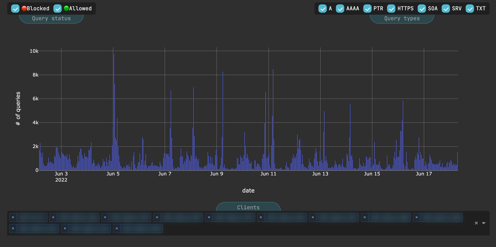

# `Dash`-based query stats plotter for `pi-hole` data



## Usage

1. Put the `pi-hole` longterm database file (typically called "pihole-FTL.db") in the current directory.
2. Create and activate python virtual environment locally, and install all the requirements:
    ```shell
    python3 -m venv ./.venv
    source ./.venv/bin/activate
    pip install -r dev-requirements.txt
    ```
3. Run the server:
    ```shell
    python app.py
    ```
4. Open the browser and go to `http://127.0.0.1:8050/` (default port).

## To-do

- [ ] Add `argparse`
- [x] Fix to proper axes (labels etc)
- [ ] Add "Select all clients" button
- [ ] Different colors for different clients (dashing = blocked/allowed)
- [x] Labels for tooltip panels
- [x] Wide screen support (limit width of plot + toolbar)
- [ ] Add ip aliases